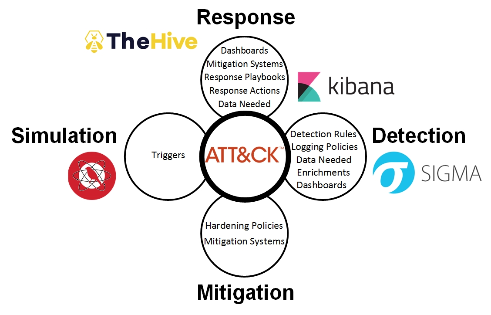

Actionable analytics designed to combat threats based on MITRE's [ATT&CK](https://attack.mitre.org/).


```
Atomic Threat Coverage is a tool that allows you to automatically generate actionable analytics, designed to combat threats (based on the [MITRE ATT&CK](https://attack.mitre.org/) adversary model) from Detection, Response, Mitigation and Simulation perspectives:

- **Detection Rules** based on [Sigma](https://github.com/Neo23x0/sigma) — Generic Signature Format for SIEM Systems
- **Data Needed** to be collected to produce detection of specific Threat
- **Logging Policies** need to be configured on data source to be able to collect Data Needed
- **Enrichments** for specific Data Needed which required for some Detection Rules
- **Triggers** based on [Atomic Red Team](https://github.com/redcanaryco/atomic-red-team) — detection tests based on MITRE's ATT&CK
- **Response Actions** which executed during Incident Response
- **Response Playbooks** for reacting on specific threat, constructed from atomic Response Actions
- **Visualisations** for creating Threat Hunting / Triage Dashboards
- **Hardening Policies** need to be implemented to mitigate specific Threat
- **Mitigation Systems** need to be deployed and configured to mitigate specific Threat
- **Customers** of the analytics — could be internal or external. This entity needed for implementation tracking

Atomic Threat Coverage is highly automatable framework for accumulation, development and sharing actionable analytics.
```

this total chapter needs to be reconstructed, simplified.
we need something like this:

ATC allows you to automatically generate actionable analytics i.e.

- Confluence and Markdown knowledge bases
- ATT&CK Navigator profiles
- Kibana dashboards
- TheHive Playbooks

And many more.

The ATC relies on analytics from set of well-known projects (i.e. Sigma, Atomic Red Team), maps them between each other using [MITRE ATT&CK](https://attack.mitre.org/) and this way help you to cover threats from Detection, Response, Mitigation and Simulation perspectives. Here are the entities it uses under the hood to build the analytics:

- Detection Rules(link to separate article on the portal) based on [Sigma](https://github.com/Neo23x0/sigma) — Generic Signature Format for SIEM Systems
- Data Needed(link to separate article on the portal) to be collected to produce detection of specific Threat
- Logging Policies(link to separate article on the portal) need to be configured on data source to be able to collect Data Needed
- and so on

Demonstrations could be found here:

- Confluence
- Markdown
- Kibana
- etc (well we don't have anythign else, right? –.-)

### Motivation

There are plenty decent projects which provide analytics (or functionality) of specific focus (i.e. [Sigma](https://github.com/Neo23x0/sigma) - Detection, [Atomic Red Team](https://github.com/redcanaryco/atomic-red-team) - Simulation, etc). All of them have one weakness — they exist in the vacuum of their area. In reality everything is tightly connected — data for alerts doesn't come from nowhere, and generated alerts don't go nowhere. Data collection, security systems administration, threat detection, incident response etc are parts of bigger and more comprehensive process which requires close collaboration of various departments.

Sometimes problems of one function could be solved by methods of other function in a cheaper, simpler and more efficient way. Most of the tasks couldn't be solved by one function at all. Each function is based on abilities and quality of others. There is no efficient way to detect and respond to threats without proper data collection and enrichment. There is no efficient way to respond to threats without understanding of which technologies/systems/measures could be used to block specific threat. There is no reason to conduct penetration test or Red Team exercise without understanding of abilities of processes, systems and personal to combat cyber threats. All of these require tight collaboration and mutual understanding of multiple departments. 

In practice there are difficulties in collaboration due to:

- Absence of common threat model/classification, common terminology and language to describe threats
- Absence common goals understanding
- Absence of simple and straightforward way to explain specific requirements
- Difference in competence level (from both depth and areas perspectives)

That's why we decided to create Atomic Threat Coverage — project which connects different functions/processes under unified Threat Centric methodology ([Lockheed Martin Intelligence Driven Defense®](https://www.lockheedmartin.com/en-us/capabilities/cyber/intelligence-driven-defense.html) aka [MITRE Threat-based Security](https://mitre.github.io/unfetter/about/)), threat model ([MITRE ATT&CK](https://attack.mitre.org/)) and provide security teams an efficient tool for collaboration on one main challenge — combating threats.

### Why Atomic Threat Coverage 

Work with existing <sup>[\[1\]](https://car.mitre.org)[\[2\]](https://eqllib.readthedocs.io/en/latest/)[\[3\]](https://github.com/palantir/alerting-detection-strategy-framework)[\[4\]](https://github.com/ThreatHuntingProject/ThreatHunting)</sup> analytics/detections repositories looks like endless copy/pasting job, manual adaptation of the information into internal analytics knowledge base format, detections data model, mappings to internal valuable metrics and entities etc.

We decided to make it different.

Atomic Threat Coverage is a framework which allows you to create and maintain **your own** analytics repository, import analytics from other projects (like [Sigma](https://github.com/Neo23x0/sigma), [Atomic Red Team](https://github.com/redcanaryco/atomic-red-team), as well as private forks of these projects with **your own** analytics) and do export into human-readable wiki-style pages in two (for now) platforms:

1. [Atlassian Confluence](https://www.atlassian.com/software/confluence) pages ([here](https://atomicthreatcoverage.atlassian.net/wiki/spaces/ATC/pages/126025996/WMI+Persistence+-+Script+Event+Consumer) is the demo of automatically generated knowledge base)
2. [This repo itself](Atomic_Threat_Coverage) — automatically generated markdown formated wiki-style pages

In other words, you don't have to work on data representation layer manually, you work on meaningful atomic pieces of information (like Sigma rules), and Atomic Threat Coverage will automatically create analytics database with all entities, mapped to all meaningful, actionable metrics, ready to use, ready to share and show to leadership, customers and colleagues.

### How it works



Everything starts from Sigma rule and ends up with human-readable wiki-style pages and other valuable analytics. Atomic Threat Coverage parses it and:

1. Maps Detection Rule to ATT&CK Tactic and Technique using `tags` from Sigma rule
2. Maps Detection Rule to Data Needed using `logsource` and `detection` sections from Sigma rule
3. Maps Detection Rule to Triggers (Atomic Red Team tests) using `tags` from Sigma rule
4. Maps Detection Rule to Enrichments using references inside Detection Rule
5. Maps Response Playbooks to ATT&CK Tactic and Technique using references inside Response Playbooks
6. Maps Response Actions to Response Playbooks using references inside Response Playbooks
7. Maps Logging Policies to Data Needed using references inside Data Needed
8. Maps Detection Rules, Data Needed and Logging Policies into Customers using references inside Customers entity
9. Converts everything into Confluence and Markdown wiki-style pages using jinja templates (`scripts/templates`)
10. Pushes all pages to local repo and Confluence server (according to configuration provided in `scripts/config.yml`)
11. Creates [Elasticsearch](https://www.elastic.co/products/elasticsearch) index for visualisation and analysis of existing data in [Kibana](https://www.elastic.co/products/kibana)
12. Creates [ATT&CK Navigator](https://mitre-attack.github.io/attack-navigator/enterprise/) profile for visualisation of current detection abilities per Customer
13. Creates [TheHive](https://thehive-project.org) Case Templates, build on top of Response Playbooks
14. Creates `analytics.csv` and `pivoting.csv` files for simple analysis of existing data
15. Creates Dashboards json files for uploading to Kibana

### Under the hood

Data in the repository:

```
├── analytics/
│   ├── generated/
│   │   ├── analytics.csv
│   │   ├── pivoting.csv
│   │   ├── atc_es_index.json
│   │   ├── thehive_templates/
│   │   │   └── RP_0001_phishing_email.json
│   │   └── attack_navigator_profiles/
│   │   │   ├── atc_attack_navigator_profile.json
│   │   │   ├── atc_attack_navigator_profile_CU_0001_TESTCUSTOMER.json
│   │   │   └── atc_attack_navigator_profile_CU_0002_TESTCUSTOMER2.json
│   │   └── visualizations/
│   │   │   └── os_hunting_dashboard.json
│   └── predefined/
│   │   ├── atc-analytics-dashboard.json
│   │   ├── atc-analytics-index-pattern.json
│   │   └── atc-analytics-index-template.json
├── customers/
│   ├── CU_0001_TESTCUSTOMER.yml
│   ├── CU_0002_TESTCUSTOMER2.yml
│   └── customer.yml.template
├── data_needed/
│   ├── DN_0001_4688_windows_process_creation.yml
│   ├── DN_0002_4688_windows_process_creation_with_commandline.yml
│   └── dataneeded.yml.template
├── detection_rules/
│   └── sigma/
├── enrichments/
│   ├── EN_0001_cache_sysmon_event_id_1_info.yml
│   ├── EN_0002_enrich_sysmon_event_id_1_with_parent_info.yaml
│   └── enrichment.yml.template
├── logging_policies/
│   ├── LP_0001_windows_audit_process_creation.yml
│   ├── LP_0002_windows_audit_process_creation_with_commandline.yml
│   └── loggingpolicy_template.yml
├── response_actions/
│   ├── RA_0001_identification_get_original_email.yml
│   ├── RA_0002_identification_extract_observables_from_email.yml
│   └── respose_action.yml.template
├── response_playbooks/
│   ├── RP_0001_phishing_email.yml
│   ├── RP_0002_generic_response_playbook_for_postexploitation_activities.yml
│   └── respose_playbook.yml.template
├── triggering/
│   └── atomic-red-team/
└── visualizations/
    ├── dashboards/
    │   ├── examples/
    │   │   └── test_dashboard_document.yml
    │   └── os_hunting_dashboard.yml
    └── visualizations/
        ├── examples/
        │   └── vert_bar.yml
        └── wmi_activity.yml
```

You can learn more about specific entities clicking on the slide bar on the left side of the page.